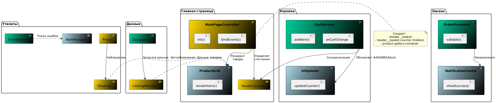

# Проектная работа "Веб-ларек"
"Web-larek" — ваш надёжный помощник в веб-разработке. Здесь собрано всё необходимое. Удобный каталог с детальными описаниями, быстрый поиск и лёгкое оформление заказа. Изучайте характеристики товаров в карточках и выбирайте именно то, что нужно для вашего проекта.

## Оглавление
1. Обзор архитектуры
2. Технологический стек
3. Структура проекта
4. Важные файлы
5. API документация
6. Компоненты системы
7. Архитектура проекта
8. Типы данных
9. Процессы в приложении
10. Установка и запуск

## Обзор архитектуры
Проект реализован с использованием паттерна MVP (Model-View-Presenter), который обеспечивает четкое разделение ответственности между ключевыми компонентами системы:

1. Модели (Model) - отвечают за работу с данными и бизнес-логику:
    - ProductModel - управляет каталогом товаров: загрузка данных с сервера, фильтрация, кэширование.
    - BasketModel - контролирует состояние корзины: добавление/удаление товаров, расчет суммы.

2. Представления (View) - Обеспечивают отображение пользовательского интерфейса:
    - MainPageView - главная страница с галереей товаров, управляет элементами интерфейса (кнопка корзины, счетчик).
    - ProductCard - универсальный компонент для отображения товара в трех режимах: галерея, модальное окно, корзина.
    - BasketView - отображает содержимое корзины и общую сумму заказа.
3. Презентер (EventEmitter) - координирует взаимодействие между слоями через систему событий:
    - Централизованная шина событий для обмена данными.
    - Обеспечивает слабую связность компонентов.
    - Обрабатывает пользовательские действия (клики, фильтрацию) и обновляет UI.
    
    ## Технологический стек
- HTML: Разметка веб-страниц с помощью тегов.
- SCSS: Препроцессор CSS с переменными, миксинами и функциями.
- TypeScript: Надстройка над JavaScript с статической типизацией.
- Webpack: Модуль-сборщик для объединения файлов, управления зависимостями и оптимизации кода.

## Структура проекта
- src/ — исходные файлы проекта.
- components/ — папка с JS компонентами.
- base/ — папка с базовым кодом.
- common/ — папка с общими компонентами.
- docs/ — схемы для документации проекта.
- images/ — графические ресурсы.
- pages/ — страницы приложения.
- public/ — статические ресурсы.
- scss/ — стили проекта.
- types/ — типы TypeScript.
- utils/ — вспомогательные утилиты.
- vendor/ — сторонние библиотеки.

## Важные файлы:
- src/pages/index.html — HTML-файл главной страницы.
- src/types/index.ts — файл с типами.
- src/index.ts — точка входа приложения.
- src/scss/styles.scss — корневой файл стилей.
- src/utils/constants.ts — файл с константами.
- src/utils/utils.ts — файл с утилитами.

## API документация
### MainPageView

**Назначение:** Управление элементами главной страницы

**Функции:**
* Подписка на события обновления счетчика корзины.
* Автоматическое обновление UI через сеттер.
* Реактивное отображение изменений.

**Поля:**
* basketButton (элемент с классом "header__basket")
* basketCounter (элемент с классом "header__basket-counter")

**Методы:**
```
class MainPageView {
  constructor(eventEmitter: EventEmitter) {
    eventEmitter.on('basket:counter-updated', (count) => {
      this.basketCount = count;
    });
  }

  set basketCount(count: number) {
    this.basketCounter.textContent = String(count);
    this.basketCounter.style.display = count > 0 ? 'block' : 'none';
  }
}
```

### EventEmitter

**Назначение:** Центральная шина событий для связи между компонентами
**Презентер (Presenter) и EventEmitter**

Презентер — это компонент, который координирует взаимодействие между моделями (Model) и представлениями (View). Он обрабатывает логику приложения, выполняет действия и передает события.
Для связи между компонентами используется `EventEmitter`. Это объект, который генерирует и обрабатывает события. EventEmitter подписывается на события и сообщает о них другим компонентам (например, отображает изменения в корзине при добавлении товаров).

**Функции:**
* Подписка/отписка на события (on, off)
* Генерация событий (emit)
* Управление списком подписчиков
```
class EventEmitter {
  on(event: string, callback: Function): void;
  off(event: string, callback: Function): void;
  emit(event: string, ...args: any[]): void;
}
```

### ProductModel

**Назначение:** Модель для управления каталогом товаров. Обеспечивает загрузку данных о товарах с сервера, их хранение и предоставление по запросу.

**Роль в приложении**
- При инициализации приложения ProductModel загружает список товаров через метод load().

- Каждая карточка товара представляется компонентом ProductCard, который использует данные из ProductModel для отображения информации.

#### Свойства:
- **items:** Массив объектов товаров, где каждый объект соответствует интерфейсу IProduct.

#### Методы:
- **load:** Асинхронно загружает список товаров с API, обновляет локальный список товаров и генерирует событие products:loaded при успешной загрузке.

```
const productModel = new ProductModel(events, api);

// Загрузка товаров
await productModel.load();
console.log(productModel.items);

```

### BasketModel

**Назначение:** Модель для управления корзиной покупок. Отвечает за добавление/удаление товаров, хранение состояния корзины, а также за оформление заказов.

#### Свойства:
- **items**: Список товаров в корзине. Каждый товар содержит тип `IProduct`.
- **orderData**: Промежуточные данные заказа (адрес, контакты, способ оплаты).

#### Методы:
- **add(product: IProduct)**: Добавляет товар в корзину. Эмитирует событие `basket:changed` с обновленным списком товаров.
- **remove(productId: string)**: Удаляет товар из корзины по ID. Эмитирует событие `basket:changed` с обновленным списком товаров.
- **getItems()**: Возвращает список товаров в корзине.
- **getTotal()**: Рассчитывает общую сумму всех товаров в корзине.
- **createOrder(orderData: IOrder)**: Создает заказ с помощью API.
- **clear()**: Очищает корзину и сбрасывает данные заказа.

```
const basketModel = new BasketModel(events, api);

// Добавление товара в корзину
basketModel.add(product);

// Получение списка товаров в корзине
console.log(basketModel.getItems());

// Создание заказа
const orderData = { address: '123 Main St', payment: 'card' };
basketModel.createOrder(orderData);
```

## Компоненты системы

### ProductCard
**Назначение:** Универсальный UI-компонент для отображения карточки товара в различных разделах приложения.

**Функции:**
* Поддерживает три варианта рендеринга:
1. Галерея (для главной страницы)
2. Модальное окно (детализация товара)
3. Корзина (список покупок - название, цена, количество)

* ProductCard не хранит данные товара, а только рендерит DOM-элемент.
* Генерирует события (product:add, product:view) при взаимодействии.

**Принцип работы:**
```
constructor(
  template: HTMLTemplateElement,
  clickHandlers: {               
    basket?: (product: Product) => void,
    details?: (product: Product) => void
  },
  eventEmitter: EventEmitter
)
```
* Возвращает готовый DOM-элемент через метод render():
```
render(productData: Product): HTMLElement
```

**Связи:**
* Получает данные товаров из ProductModel (через родительские компоненты)
* Взаимодействует с BasketModel через события EventEmitter
* Используется тремя компонентами:

1. MainPageView - для отображения в галерее
2. ModalView - для детального просмотра
3. BasketView - для отображения в корзине

### BasketView
**Назначение:** Отображение содержимого корзины

**Функции:**
* Рендер списка товаров
* Отображение общей суммы
* Обновление счетчика товаров

**Реактивный подход:**

* Обновление состояния корзины происходит в BasketModel, который генерирует событие через EventEmitter. MainPageView и BasketView подписываются на это событие и обновляют интерфейс автоматически, что позволяет поддерживать актуальные данные без необходимости вручную синхронизировать состояния.
```
class BasketView {
  updateItems(items: CartItem[]): void;
  updateTotal(sum: number): void;
}
```

### Связь между MainPageView и BasketView
* MainPageView управляет кнопкой корзины и счётчиком товаров.
* BasketView отображает список товаров и общую сумму покупки.
* BasketModel обновляет данные о корзине, а MainPageView и BasketView подписаны на его события через EventEmitter.

## Архитектура проекта

### Основные части системы:

1. Модели (Model) - работа с данными и бизнес-логикой
* ProductModel - ядро каталога товаров:

1. Асинхронная загрузка товаров с сервера
2. Реализация механизмов фильтрации (по категориям, цене)
3. Предоставление данных по запросу

* BasketModel - логика корзины:
1. Добавление/удаление позиций
2. Автоматический пересчет итоговой суммы
3. Персистентное хранение в localStorage
4. Контроль количества каждого товара

* OrderModel - обработка заказов:
1. Валидация контактных данных 
2. Формирование JSON для API
3. Отправка на сервер с обработкой ответа


2. Представления (View) - пользовательский интерфейс

* MainPageView (новый) - корневой экран:

1. Адаптивная сетка товаров
2. Хедер с интерактивной корзиной
3. Подготовка под будущую навигацию

* ProductCard - универсальный компонент карточки товара:

1. Поддержка 3 шаблонов (галерея, модалка, корзина)
2. Отрисовка данных товара
3. Генерация событий при взаимодействии

* BasketView -  интерфейс корзины:

1. Динамический рендеринг списка
2. Отображение изменяемой суммы
3. Кнопки управления заказом

* CheckoutForm - финальный этап:

1. Валидация полей в реальном времени
2. Сбор данных со всех этапов
3. Визуализация процесса отправки


3. Презентер (EventEmitter) - координация взаимодействия

* Централизованная шина событий

* Функции:

1. Подписка/отписка на события (on, off)
2. Генерация событий (emit)
3. Управление подписчиками

* Обеспечивает слабую связность компонентов
## UML



### Главные взаимодействия:

1. ProductModel/BasketModel → EventEmitter → MainPageView/BasketView
2. MainPageView → создаёт → ProductCard
3. ProductCard/CheckoutForm → EventEmitter → Модели

## Типы данных
### Основные интерфейсы:
```
export interface Product {
    id: string;
    title: string;
    price: number | null;
    description: string;
    image: string;
    category: string;
}

export interface CartItem {
    productId: string;
    quantity: number;
}

export interface OrderData {
    items: CartItem[];
    address: string;
    email: string;
    phone: string;
    paymentMethod: 'card' | 'cash';
}
```
### Интерфейсы моделей:
```
export interface IProductModel {
    items: Product[];
    loadProducts(): Promise<void>;
    getProduct(id: string): Product | undefined;
    filterProducts(criteria: Record<string, unknown>): Product[];
}

export interface IBasketModel {
    items: Map<string, number>;
    add(id: string): void;
    remove(id: string): void;
    clear(): void;
    getTotal(): number;
}

export interface IOrderModel {
    createOrder(data: OrderData): Promise<void>;
    validateOrder(data: OrderData): boolean;
}
```
### Интерфейсы представлений:
```
export interface IView {
    render(data?: object): HTMLElement;
}

export interface IMainPageView extends IView {
    updateBasketCounter(count: number): void; 
    setProducts(products: Product[]): void;   
    setBasketClickHandler(handler: () => void): void; 
}

export interface IProductCard extends IView {
    constructor(
        template: HTMLTemplateElement,
        handlers: {                    
            basket?: () => void,
            details?: () => void
        }
    );
    render(product: Product): HTMLElement; 
}

export interface IBasketView extends IView {
    updateItems(items: CartItem[]): void; 
    updateTotal(sum: number): void;      
}

export interface ICheckoutForm extends IView {
    setSubmitHandler(handler: (data: OrderData) => void): void;
    showValidationErrors(errors: string[]): void; 
}
```
### Дополнительные типы:
```
// События EventEmitter
export type AppEvents = {
    'product:add': { productId: string };
    'product:view': { productId: string };
    'basket:update': { items: Map<string, number> };
    'order:submit': OrderData;
};

// Конфигурация карточки товара
export type ProductCardConfig = {
    template: 'gallery' | 'modal' | 'basket';
    handlers: {
        basketClick?: () => void;
        detailsClick?: () => void;
    };
};
```
## Процессы в приложении

### 1. Загрузка главной страницы:

* Инициализация UI:
1. MainPageView создает элементы интерфейса:

   *Кнопку корзины (header__basket)*

   *Счетчик товаров (header__basket-counter), скрытый по умолчанию*

   *Контейнер для галереи товаров*

* Загрузка данных:

1. ProductModel выполняет запрос к API для получения каталога товаров

2. После получения данных генерирует событие products:loaded с массивом товаров

* Отрисовка товаров:

1. MainPageView подписывается на products:loaded

2. Для каждого товара создает экземпляр ProductCard в режиме "галерея":

*Устанавливает обработчики событий:*

   1. "Добавить в корзину" → product:add

   2. "Просмотр деталей" → product:view

*Добавляет карточку в галерею*

* Инициализация корзины:

1. BasketModel загружает сохраненное состояние из localStorage

2. Если есть товары, генерирует событие basket:updated с текущим состоянием (Map)

### 2. Работа с корзиной:

* Добавление товара:

1. Инициация действия:

*Пользователь кликает "Добавить" в ProductCard*

*Генерируется событие product:add с ID товара*

2. Обработка в модели:

* BasketModel:

  *Увеличивает количество товара (или добавляет новый)*

  *Рассчитывает общее количество товаров через метод calculateTotalCount()*

  *Сохраняет обновленное состояние в localStorage*

  *Генерирует событие basket:counter-updated с новым количеством*

  *Генерирует событие basket:items-updated с обновленным Map товаров*

* Обновление интерфейса:

1. MainPageView:

  *Получает новое количество через basket:counter-updated*

  *Автоматически обновляет счетчик через сеттер basketCount*

2. BasketView (если открыт):

  *Получает обновленные данные через basket:items-updated*

  *Для каждого товара запрашивает детали через ProductModel*

  *Создает ProductCard в режиме "корзина*

  *Пересчитывает сумму через BasketModel.getTotal()*

* Удаление товара:

  1. Обработка в модели:

  * BasketModel:

  *Уменьшает количество товара*

  *При нулевом количестве удаляет товар из Map*

  *Если корзина пуста, генерирует basket:counter-updated с 0*

  *Генерирует basket:items-updated с пустым Map*

  2. Обновление интерфейса:

  *MainPageView скрывает счетчик при получении 0*

  *BasketView обновляет список и сумму*

## Установка и запуск
Для установки и запуска проекта необходимо выполнить команды

```
npm install
npm run start
```

или

```
yarn
yarn start
```
## Сборка

```
npm run build
```

или

```
yarn build
```